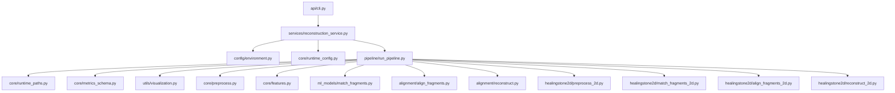

# Architecture

## Runtime Call Path

```text
CLI
  -> healingstone.api.cli.main
  -> healingstone.services.reconstruction_service.execute_reconstruction
  -> env defaults
  -> config merge and validation
  -> project-root-relative path resolution
  -> mode detection
  -> 2D or 3D reconstruction pipeline
  -> run-scoped artifacts
```

## Module Graph



## Layers

| Layer | Responsibility | Key Files |
| --- | --- | --- |
| CLI | parse arguments and enter service boundary | `src/healingstone/api/cli.py` |
| Service | merge env/config/runtime and invoke pipeline | `src/healingstone/services/reconstruction_service.py` |
| Core policy | config, paths, metrics schema, deterministic runtime contracts | `src/healingstone/core/*.py` |
| 3D engine | preprocess, feature extraction, matching, alignment, reconstruction | `core/preprocess.py`, `core/features.py`, `ml_models/match_fragments.py`, `alignment/*.py` |
| 2D engine | preprocess, descriptor matching, alignment, canvas reconstruction | `src/healingstone/healingstone2d/*.py` |
| Utilities | plotting and runtime fingerprints | `src/healingstone/utils/*.py` |

## 3D Data Flow

```text
mesh fragments
  -> Open3D load
  -> denoise + downsample + normals
  -> feature extraction
  -> Siamese pair scoring
  -> candidate selection
  -> RANSAC + ICP alignment
  -> graph assembly
  -> merged point cloud + metrics + plots
```

## 2D Data Flow

```text
image fragments
  -> preprocessing + edge extraction
  -> shape descriptors
  -> candidate matching
  -> rigid 2D alignment
  -> canvas assembly
  -> reconstructed image + minimal report
```

## External Dependencies

| Dependency | Role | Scope |
| --- | --- | --- |
| `numpy` | numerical operations | all modes |
| `matplotlib` | diagnostic plots | all modes |
| `PyYAML` + `pydantic` | config loading and validation | all modes |
| `networkx` | graph assembly | all modes |
| `open3d` | mesh IO, geometry, ICP, FPFH | 3D only |
| `torch` | Siamese and classifier training | 3D only |
| `opencv-python` | 2D preprocessing and rendering | 2D only |
