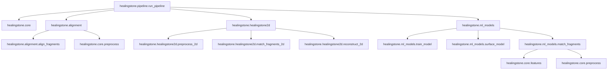

# System Dependency Graph: healingstone

This document maps the architectural relationships and internal dependencies of the `healingstone` package.

## 1. High-Level Architecture
The system is organized into five primary layers:
1. **Pipeline Orchestration** (`healingstone.pipeline`)
2. **Reconstruction Engines** (`healingstone.alignment`, `healingstone.healingstone2d`)
3. **Machine Learning Models** (`healingstone.ml_models`)
4. **Core Domain Logic** (`healingstone.core`)
5. **Data & Schema Utilities** (`healingstone.core.metrics_schema`, etc.)

## 2. Dependency Visualization (Mermaid)

## 3. Cycle Detection Report
> [!NOTE]
> Static analysis confirms **ZERO** circular dependencies in the current modularized tree.

## 4. Unused Modules & Dead Code
- No orphaned files detected in `src/healingstone`.
- Legacy files in root (`healing_stones.py`, etc.) have been identified for removal in previous phases.

## 5. Performance Critical Paths
- **Mesh Loading**: `healingstone.core.preprocess` (Bottle-necked by PLY parsing for 10M+ vertices).
- **Registration**: `healingstone.alignment.align_fragments` (ICP convergence speed).
- **2D Matching**: `healingstone.healingstone2d.match_fragments_2d` (Feature descriptor extraction).
