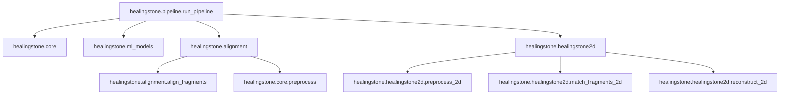

# System Specification: Healingstone

## 1. Project Overview
**Healingstone** is a production-oriented reconstruction pipeline for fragmented archaeological artifacts. It supports both 3D mesh fragments (`.ply`, `.obj`) and 2D image fragments (`.png`, `.jpg`, `.tif`). The system automatically detects the input type and routes it to the appropriate pipeline.

### Problem Definition
Fragmented archaeological artifacts present a difficult reconstruction problem due to:
- Unknown relative orientation of fragments.
- Missing material along break surfaces.
- Erosion and scan noise.
- Variable fragment sizes.

The objective is to automatically determine:
1. Break surfaces on each fragment.
2. Matching fragment pairs.
3. Relative pose transformations.
4. Global assembly of fragments.

---

## 2. Technical Approach
The pipeline follows a multi-stage process to achieve reconstruction:

1. **Preprocessing**: Normal estimation, decimation, and noise reduction using Open3D.
2. **Break Surface Classification**: Identification of likely break surfaces vs. original carved surfaces.
3. **Feature Extraction**: FPFH (Fast Point Feature Histograms) for 3D or specific 2D descriptors.
4. **Pairwise Matching**: Pruning candidate pairs and scoring matches.
5. **Alignment**: RANSAC + ICP for geometric registration (SE(3) estimation).
6. **Global Assembly**: Pose Graph Optimization for final reconstruction.

---

## 3. Inputs and Outputs

### Inputs
| Input | Type | Required | Notes |
| --- | --- | --- | --- |
| `--data-dir` | directory | No | Defaults via dataset alias manifest |
| fragment files | `.ply` / `.obj` / images | Yes | Mode auto-detected from files present |
| `--labels-csv` | CSV | No | Supervised pair labels with `frag_a,frag_b,label` |
| pipeline config | YAML | Yes | `configs/pipeline.yaml` |

### Outputs
All outputs are run-scoped and isolated under `artifacts/runs/<run_id>/`.

| Output | Path | Description |
| --- | --- | --- |
| **Results** | `results/` | Reports, plots, and reconstructed models (`.ply`). |
| **Models** | `models/` | Trained model weights if applicable. |
| **Logs** | `logs/` | Detailed execution and error logs. |
| **Cache** | `cache/` | Reusable feature/cache payloads. |

---

## 4. Success Conditions
- Pipeline runs end-to-end from CLI without manual interaction.
- Paths resolve deterministically from the project root.
- Metrics report satisfies schema version `1`.
- Default developer checks (pytest, ruff, mypy) pass.

---

## 5. System Dependencies
The system is organized into modular layers to ensure zero circular dependencies and clear boundaries.

---

## 6. Non-Goals
- GUI or manual reconstruction tooling.
- Archaeological interpretation of the results.
- Guaranteed perfect reconstruction under severe erosion or missing geometry.
