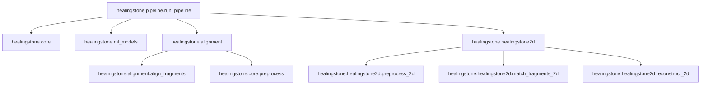

# System Specification: Healing Stones

**Healing Stones** is an automated reconstruction pipeline that transforms unstructured 3D fragment data into structured geometric relationships and globally consistent assemblies. It integrates geometric processing with machine learning to identify fracture surfaces, extract robust features, and estimate fragment poses under noise, erosion, and partial overlap.

---

## 1. Project Overview

### Abstract
Fragmented cultural artifacts such as sculptures and monuments are commonly incomplete and eroded, making manual reassembly labor-intensive. **Healing Stones** proposes a modular computational pipeline that performs automated reconstruction through surface classification, embedding-based matching, and graph-based assembly.

### Novel Contribution
Unlike standard registration pipelines, **Healing Stones** introduces:
1. **Confidence-Aware Matching**: Each candidate match is assigned a confidence score based on a weighted sum of:
   - Geometric alignment error.
   - Normal consistency.
   - Overlap ratio.
2. **Patch-Level Matching**: By operating on fracture surface patches rather than whole fragments, the system achieves robustness to size differences, improved matching under partial overlap, and reduced noise from irrelevant surfaces.
3. **Global Assembly with Consistency Constraints**: Transitions from naive MST-based assembly to a framework incorporating:
   - Cycle consistency checks.
   - Confidence-weighted edge selection for transformation propagation.
   - Rejection of conflicting spatial placements.

---

## 2. Technical Objectives

The system is designed to:
- **Ingest**: Support `.PLY` and `.OBJ` formats from heterogeneous sources.
- **Preprocess**: Perform denoising (outlier filtering), downsampling (voxel-based), and normal estimation.
- **Classify**: Identify fracture surfaces vs. original carved surfaces.
  - **Geometric Baseline**: Threshold-based classification using curvature and normal variance.
  - **Learning-Based Extension**: Pseudo-label fracture regions to train a point-based classifier (e.g., **PointNet++**).
- **Extract Features**: Compute rotation-invariant descriptors.
  - **Geometric**: **FPFH** (Fast Point Feature Histograms).
  - **Learned**: **PointNet** or **DGCNN** embeddings via PyTorch.
- **Match**: Predict fragment compatibility using patch-level similarity (Cosine Similarity).
- **Align**: Estimate 6-DoF poses using feature correspondence + RANSAC for coarse alignment, followed by **ICP** for fine registration.
- **Assemble**: Resolve global consistency using graph-based optimization (MST or Pose Graph) that propagates the high-confidence matched transformations.

---

## 3. System Architecture

The architecture is divided into clear functional layers to ensure modularity and extensibility:

### Ingestion Layer
- Dataset-specific loaders for varying scan properties.
- Validation of mesh integrity and coordinate standardization.

### Processing Layer
- **Preprocessing Engine**: Denoising, voxel downsampling, and scale normalization.
- **Surface Classification Module**: Feature-based classification of fracture regions.
- **Feature Extraction Module**: Computation of geometric and learned descriptors.
- **Matching & Alignment Module**: Pairwise registration and validation.

### Assembly Layer
- Graph-based representation of fragments (nodes) and validated matches (edges).
- Pose graph optimization to propagate transformations and resolve conflicts.

### Storage & Evaluation Layer
- Structured JSON output for transformations and metadata.
- Automated evaluation of matching accuracy, alignment error (RMSE/Chamfer), and reconstruction completeness.

---

## 4. Methodology (Pipeline Workflow)

1. **Data Ingestion** $\rightarrow$ Standardized 3D representation.
2. **Preprocessing** $\rightarrow$ Denoising, downsampling, and normal estimation.
3. **Surface Classification** $\rightarrow$ Isolation of fracture surface patches.
4. **Feature Extraction** $\rightarrow$ Encoding invariants for robust comparison.
5. **Candidate Matching** $\rightarrow$ Filtering the search space using similarity thresholds.
6. **Alignment (Pose Estimation)** $\rightarrow$ SE(3) transformation estimation.
7. **Global Assembly** $\rightarrow$ Consistency-aware reconstruction.
8. **Evaluation** $\rightarrow$ Benchmarking against ground truth metrics.

---

## 5. System Dependencies

---

## 6. Success Conditions & Metrics

- **Matching Accuracy**: Precision, Recall, and F1-score for fragment identification.
- **Alignment Quality**: Mean RMSE and Chamfer Distance within defined thresholds.
- **Reconstruction Completeness**: Fraction of the original artifact successfully reconstructed.
- **Workability**: Full CI passing (pytest, ruff, mypy) and deterministic CLI execution.
